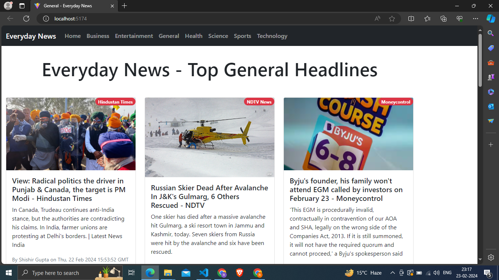

# React + Vite

Project Name

Overview
I'm thrilled to present Everyday News , News Hub is your gateway to a diverse world of news, offering dynamic updates across Technology, Sports, Entertainment, Science, Business, and more. With its infinite scroll feature, the app seamlessly loads new articles, ensuring a never-ending news experience. Enjoy real-time updates and a user-friendly interface for effortless navigation. Throughout the development phase, I integrated a dynamic API to enhance functionality and user experience. However, upon deployment to production, CORS policy restrictions emerged, impacting API calls in the live environment.

Project Highlights
Technologies Used: html, Css, Javascript, Reactjs, Spinner
Features: infinite scroll feature

How to View
As a temporary measure, I'm sharing a screenshot of the localhost front page to provide a glimpse of the project. Please note that the CORS policy issue affects the live production version. However, the local development version showcases the core features.

Future Plans
I am actively working on resolving the CORS policy issue to offer a seamless live demonstration of the project. Stay tuned for updates!

Feedback
Feel free to explore the code and share any feedback. Your insights are valuable as I continue to improve and refine Everyday News.

This template provides a minimal setup to get React working in Vite with HMR and some ESLint rules.

Currently, two official plugins are available:

- [@vitejs/plugin-react](https://github.com/vitejs/vite-plugin-react/blob/main/packages/plugin-react/README.md) uses [Babel](https://babeljs.io/) for Fast Refresh
- [@vitejs/plugin-react-swc](https://github.com/vitejs/vite-plugin-react-swc) uses [SWC](https://swc.rs/) for Fast Refresh
